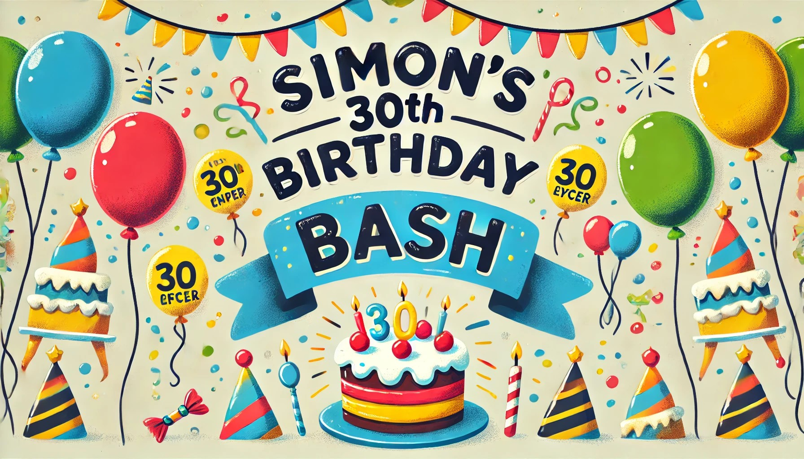

# 🎉 Simon's 30th Birthday Bash - Website 🎉

### Welcome, fellow humans (or bots)!

This is the glorious, absolutely necessary website for **Simon’s 30th Birthday**! If you're here, you’re either:

- 🎟️ Looking to register and claim your spot at the coolest event of the year, or
- 🤓 Just curious about the tech stack that makes this all possible.

Forget world-changing features or cutting-edge AI. This site is just for **registration** and **event information**. But
hey, it’s all about the journey, right? And the cake. 🍰 Definitely the cake.

---

### Tech Stack ⚙️

- **Laravel**: Because nothing says "smooth sailing" quite like an expressive and elegant syntax that makes PHP look
  good. 🌊
- **Laravel Livewire (with Volt)** ⚡: Yes, Volt, because my birthday site needs to be electrifyingly reactive (pun
  intended).
- **Flux (Livewire Component)**: Bringing the flux into this occasion. No flux capacitors, but it does keep things
  futuristic. 🚀
- **Tailwind CSS**: Styling this site like a pro without writing CSS from scratch. Who has time for that? 💅

---

### 💥 WordArt Magic 💥

A huge shout-out to the [CSS3 WordArt](https://github.com/arizzitano/css3wordart) repo! 🎨 The retro WordArt fonts add
that perfect 90s touch that every 30th birthday site deserves. Thanks to their awesome work, we’re bringing those
WordArt vibes back, one flashy headline at a time. ✨

---

### FAQ (Foolishly Asked Questions) 🤔

- **Why Laravel?** \
  🍂 Because if it's good enough to build the web’s coolest apps, it’s definitely good enough for the coolest
  30-year-old.

- **Is this website open-source?** \
  🍰 Nope, but if you want the cake recipe, I might share that.

- **Can I contribute?** \
  🍻 Only if you bring snacks. Or drinks. Preferably both.

---

### 📚 Documentation and All That Serious Stuff

If you absolutely must know how Laravel works, please visit the
official [Laravel Documentation](https://laravel.com/docs). They have all the serious things you could ever want to
know, like routes, controllers, and why PHP isn’t dead yet.

Or, sit back and binge-watch [Laracasts](https://laracasts.com), where they make PHP, Laravel, and JavaScript feel like
a blockbuster series. 🍿

---

### License 📝

This masterpiece of a registration form is open to anyone who wants to attend the event. Otherwise, all rights reserved
to **Simon’s right to celebrate his 30th in peace and great company.**

---

### MIT License

This project is licensed under the MIT License. For more legalese details, please
see [MIT License](https://opensource.org/licenses/MIT).

---

### P.S.

🎂 Remember: Bring yourself, bring good vibes, and bring an appetite for cake. Laravel handles the backend, but **you**
make the front-end of the party!
